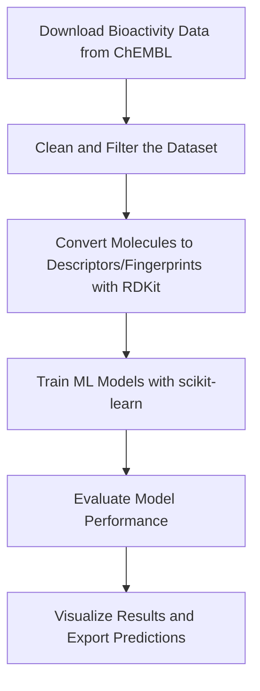

# QSAR Pipeline for Molecular Bioactivity Prediction

**Author:** Iker Zapirain Gysling  
**Project Type:** Cheminformatics + Machine Learning + Drug Discovery  

**Status:** 🚧 In Progress  

---

## Project Overview

This project builds a complete QSAR (Quantitative Structure–Activity Relationship) pipeline to predict molecular bioactivity from chemical structure. 

Using real data from the **ChEMBL database**, molecular structures are processed into descriptors and fingerprints with **RDKit**, modeled with **scikit-learn**, and evaluated for predictive performance.

The entire workflow is designed as a clean, modular, and portfolio-quality example of applying machine learning in drug discovery.

---

## Objectives

- Extract and clean real-world bioactivity data from **ChEMBL**
- Generate molecular descriptors and fingerprints using **RDKit**
- Train machine learning models (regression/classification) with **scikit-learn**
- Evaluate performance using metrics and visualizations
- Organize project for reproducibility and GitHub presentation

---

## Tools and Technologies

| Tool/Library         | Purpose                                      |
|----------------------|----------------------------------------------|
| **ChEMBL**           | Source of real molecular bioactivity data    |
| **RDKit**            | Molecular descriptor and fingerprint generation |
| **scikit-learn**     | Machine learning modeling                    |
| **pandas + NumPy**   | Data handling and numerical operations       |
| **matplotlib + seaborn** | Data visualization and evaluation       |
| **Jupyter Notebook** | Interactive analysis and documentation       |

---

## Target Protein

- **Target:** EGFR (Epidermal Growth Factor Receptor)  
- **ChEMBL ID:** [CHEMBL203](https://www.ebi.ac.uk/chembl/target_report_card/CHEMBL203/)
- **Why this target?** EGFR is a well-known cancer drug target with extensive experimental data available — ideal for QSAR modeling.

---

## Workflow Summary



---

## Repository Structure

## Repository Structure

```text
qsar-pipeline-project/
│
├── README.md                    ← This file
│
├── data/                        ← Raw and processed data files
│   ├── chembl_egfr_clean.csv    ← Cleaned IC50 + SMILES data
│   ├── descriptors.csv          ← RDKit physicochemical descriptors
│   ├── fingerprints.npy         ← Morgan fingerprints (X input for ML)
│   └── labels.csv               ← pIC50 values (y labels for ML)
│
├── notebooks/                   ← Step-by-step Jupyter notebooks
│   ├── 01_data_collection.ipynb ← Data download + cleaning
│   └── 02_featurization.ipynb   ← Descriptor + fingerprint generation
│
├── scripts/                     ← Utility scripts (to be added)
│
├── results/                     ← Plots, metrics, and final outputs
│
└── models/                      ← Trained ML models
```

---

## Key Analyses

- **Distribution of activity values** (e.g., IC50, pIC50)
- **Feature importance in ML models**
- **Model metrics**: R², MAE, RMSE (regression) or accuracy, precision, ROC (classification)
- **Descriptor vs. Fingerprint performance comparison**
- **Data cleaning impact and molecule counts**

---

## Future Improvements

- Add support for additional targets from ChEMBL
- Include advanced ML techniques (e.g., Random Forests, XGBoost)
- Extend pipeline to classification tasks (active/inactive)
- Package as a command-line tool or Streamlit app for demo

---

## Learning Outcomes

Understand the QSAR modeling pipeline  
Work with public bioactivity databases like ChEMBL  
Learn RDKit for cheminformatics  
Train and interpret ML models in drug discovery contexts  
Maintain clean, documented GitHub projects  

---

## License and Citation

This project is for academic and portfolio purposes.  

---
